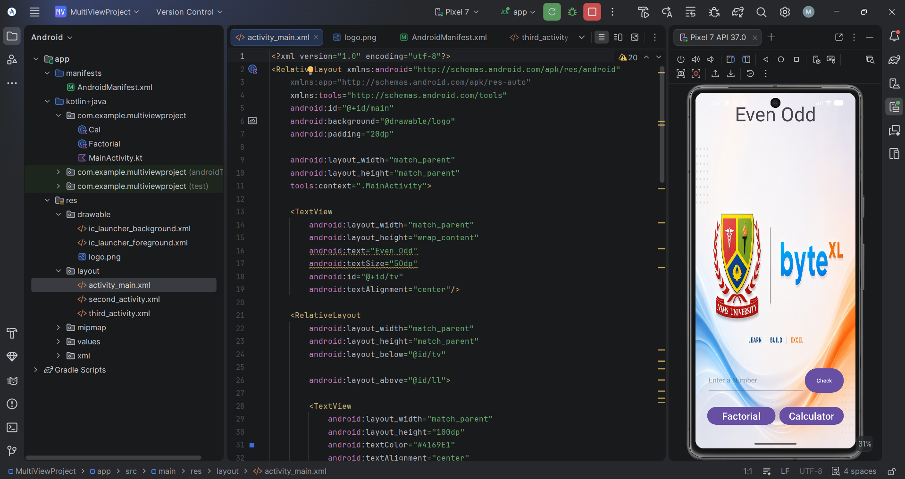
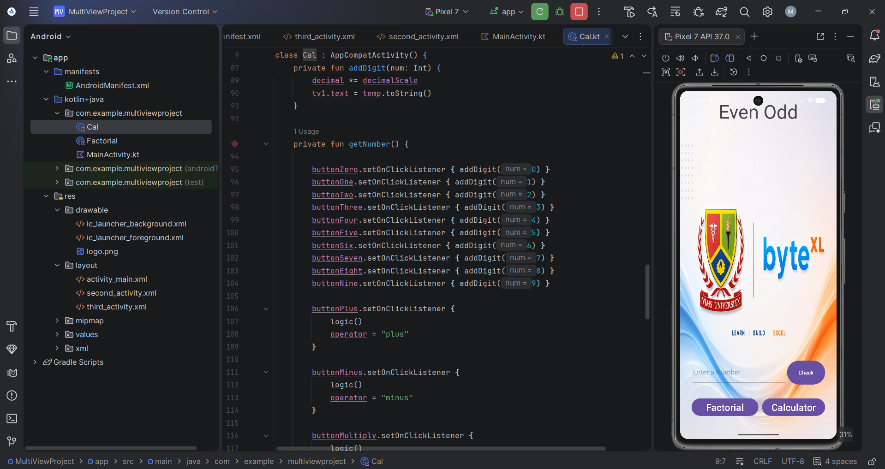
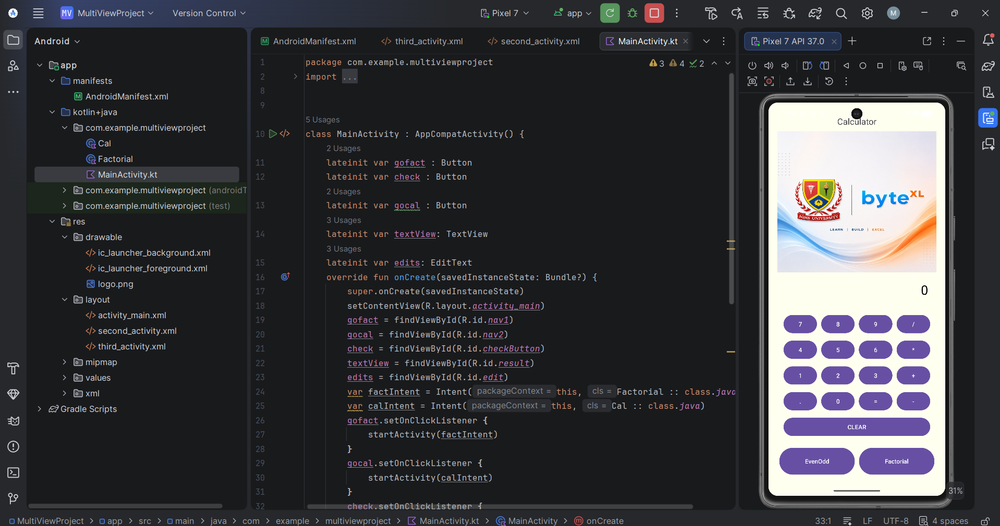
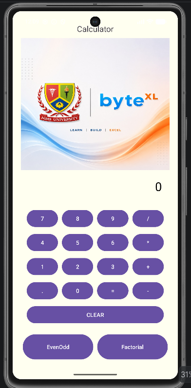

<div align="center">

# 🔢 MultiView

### *Three Screens. One Powerful App. Zero Complexity.*

<br>

[](https://developer.android.com)
[](https://kotlinlang.org)
[](https://developer.android.com/about/versions/nougat)
[](LICENSE)
[]()

</div>

---

## 🚀 Overview

> **MultiView** is a versatile Android utility app designed to simplify daily mathematical tasks. Featuring three seamless screens, it allows users to quickly check if a number is even or odd, compute complex factorials, and perform standard arithmetic operations in a clean, user-friendly interface.

Built with **Kotlin** and powered by explicit **Intent-based navigation**, MultiView is a showcase of clean Android architecture — lightweight, fast, and intuitive for users of all levels.

---

## ✨ Features

- 🔵 **Even / Odd Checker** — Instantly determine whether any integer is even or odd with a single tap. Lightweight and lightning-fast.
- 🟣 **Factorial Calculator** — Compute factorials for complex numbers with precision. Handles large values gracefully with robust error handling.
- 🟠 **Arithmetic Calculator** — Perform everyday addition, subtraction, multiplication, and division in a clean, responsive interface.
- 🎯 **Seamless Navigation** — Screens are connected via **Explicit Intents**, ensuring predictable, reliable transitions across the entire app.
- 🧩 **Modular Architecture** — Each feature lives in its own `Activity`, keeping the codebase clean, maintainable, and easy to extend.
- 📐 **Pixel-Perfect UI** — Designed with XML layouts, delivering a consistent and polished experience across all screen sizes.
- ⚡ **Zero Dependencies** — No third-party libraries. Pure Android SDK — fast, minimal, and dependency-free.

---

## 📱 App Showcase

<div align="center">

### Main Navigation Screen


<br><br>

<table>
  <tr>
    <td align="center" style="padding: 12px;">
      
      <br><br>
      <b>🔵 Even / Odd Checker</b>
      <br>
      <sub>Enter any integer and instantly find out whether it's even or odd.</sub>
      <br>
      <code>screenshots/MultiView_oddeven.png</code>
    </td>
    <td align="center" style="padding: 12px;">
      
      <br><br>
      <b>🟠 Arithmetic Calculator</b>
      <br>
      <sub>Perform standard math operations with a clean, responsive keypad UI.</sub>
      <br>
      <code>screenshots/MultiView_calculator.png</code>
    </td>
    <td align="center" style="padding: 12px;">
      
      <br><br>
      <b>📱 Phone View</b>
      <br>
      <sub>Full app experience across all features in a single device view.</sub>
      <br>
      <code>screenshots/MultiView_phoneview.png</code>
    </td>
  </tr>
</table>

</div>

---

## 🛠️ Tech Stack

| Technology | Purpose |
|:---:|:---|
|  | Primary programming language |
|  | UI layout & design |
|  | IDE & build toolchain |
|  | Screen-to-screen navigation |
|  | Dependency management & builds |

---

## ⚙️ Installation

### Prerequisites

Before you begin, make sure you have the following installed:

- ✅ [Android Studio](https://developer.android.com/studio) (Hedgehog or later recommended)
- ✅ Android SDK with **API Level 24+**
- ✅ Git

---

### 🖥️ Clone the Repository

```bash
# 1. Clone the project
git clone <your-repository-url>

# 2. Navigate into the project directory
cd MultiView

# 3. Open in Android Studio
studio .
```

---

### 📲 Build & Run

**Option A — Android Studio (Recommended)**

1. Open **Android Studio** and select **`File → Open`**
2. Navigate to the cloned `MultiView/` directory and click **OK**
3. Wait for Gradle to sync all dependencies automatically
4. Connect a physical device **or** launch an AVD (Android Virtual Device)
5. Hit the ▶️ **Run** button — you're live!

**Option B — Command Line (Gradle)**

```bash
# Build a debug APK
./gradlew assembleDebug

# Install directly to a connected device
./gradlew installDebug

# Run all unit tests
./gradlew test
```

> 💡 **Tip:** The compiled APK will be located at `app/build/outputs/apk/debug/app-debug.apk`

---

## 📁 Project Structure

```
MultiView/
├── app/
│   ├── src/
│   │   └── main/
│   │       ├── java/com/example/multiviewproject/
│   │       │   ├── MainActivity.kt          # Entry point & navigation hub
│   │       │   ├── Cal.kt                   # Arithmetic calculator logic
│   │       │   └── Factorial.kt             # Factorial computation logic
│   │       ├── res/
│   │       │   ├── layout/                  # XML layout files (activity_main.xml, second_activity.xml, third_activity.xml)
│   │       │   ├── drawable/                # Icons & graphics
│   │       │   ├── mipmap-*/                # App icons (multiple DPI versions)
│   │       │   ├── values/                  # Colors, strings, themes
│   │       │   ├── values-night/            # Dark theme resources
│   │       │   └── xml/                     # Backup & data extraction rules
│   │       └── AndroidManifest.xml
│   └── build.gradle.kts
├── screenshots/                             # App screenshot assets
│   ├── MultiView_activitymain.png
│   ├── MultiView_oddeven.png
│   ├── MultiView_calculator.png
│   └── MultiView_phoneview.png
├── gradle/
├── build.gradle.kts
├── gradle.properties
├── settings.gradle.kts
└── README.md
```

---

## 🤝 Contributing

Contributions are what make the open-source community such an incredible place to **learn, inspire, and create**. We warmly welcome all contributions — big or small!

**Here's how to get involved:**

1. 🍴 **Fork** this repository
2. 🌿 **Create** your feature branch — `git checkout -b feature/AmazingFeature`
3. 💾 **Commit** your changes — `git commit -m 'Add some AmazingFeature'`
4. 📤 **Push** to the branch — `git push origin feature/AmazingFeature`
5. 🔁 **Open a Pull Request** and describe what you've built

> 💬 Found a bug? Have a suggestion? Don't hesitate to [open an issue](https://github.com/your-repo/MultiView/issues). All feedback is appreciated!

---

## 📄 License

Distributed under the **MIT License**. See [`LICENSE`](LICENSE) for full details.

```
MIT License

Copyright (c) 2025 MultiView Contributors

Permission is hereby granted, free of charge, to any person obtaining a copy
of this software and associated documentation files (the "Software"), to deal
in the Software without restriction, including without limitation the rights
to use, copy, modify, merge, publish, distribute, sublicense, and/or sell
copies of the Software, and to permit persons to whom the Software is
furnished to do so, subject to the following conditions:

The above copyright notice and this permission notice shall be included in all
copies or substantial portions of the Software.

THE SOFTWARE IS PROVIDED "AS IS", WITHOUT WARRANTY OF ANY KIND, EXPRESS OR
IMPLIED, INCLUDING BUT NOT LIMITED TO THE WARRANTIES OF MERCHANTABILITY,
FITNESS FOR A PARTICULAR PURPOSE AND NONINFRINGEMENT.
```

---

<div align="center">

**Made with ❤️ and Kotlin**

⭐ If you found this project helpful, please consider giving it a star!

[](https://github.com/your-repo/MultiView_Math)
[](https://github.com/your-repo/MultiView_Math/fork)

</div>
